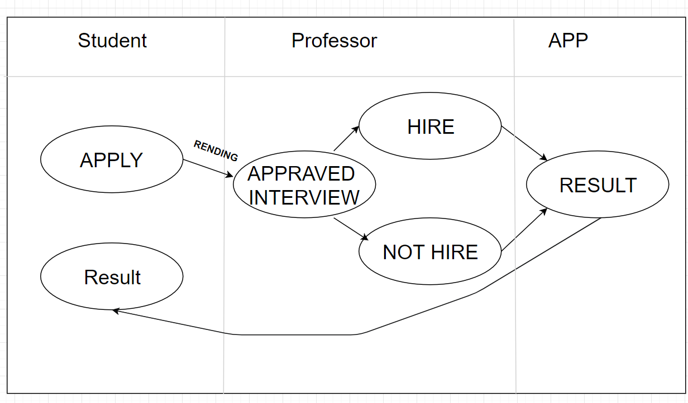
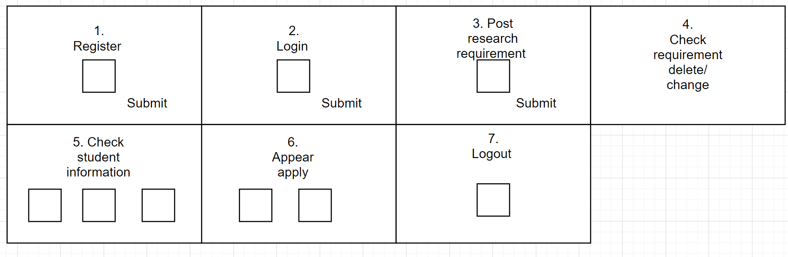
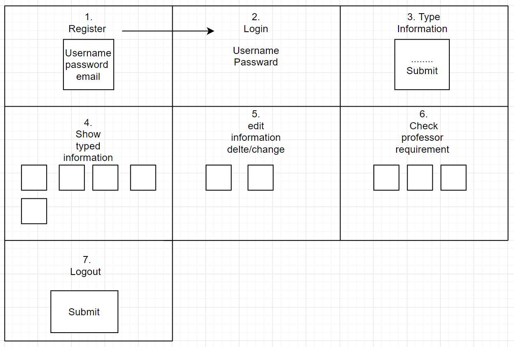

# Academic Search Engine    

## VRC (Virtual Research Center)

--------
Prepared by: Team 9

---

**Course** : Software Engineering Principles 

---

## Table of Contents
- [Software Requirements Specification](#software-requirements-specification)
  - [Project Title](#-your-project-title)
  - [Table of Contents](#table-of-contents)
  - [Document Revision History](#document-revision-history)
- [1. Introduction](#1-introduction)
  - [1.1 Document Purpose](#11-document-purpose)
  - [1.2 Product Scope](#12-product-scope)
  - [1.3 Document Overview](#13-document-overview)
- [2. Requirements Specification](#2-requirements-specification)
  - [2.1 Customer, Users, and Stakeholders](#21-customer-users-and-stakeholders)
  - [2.2 Use Cases](#22-use-cases)
  - [2.3 Non-Functional Requirements](#23-non-functional-requirements)
- [3. User Interface](#3-user-interface)
- [4. References](#4-references)

----
# 1. Introduction

This product will be helping the student to search and apply for their interested research position. Faculty may also post position on the via website to select for the applicants. We are creating a tool to allows student and faulty to easily be connected. The software requirement specification requires an online platform that allows the faculty to advertise their research positions and connect them with qualified students.
Students can upload their contact information, research interest, experience, and completed coursework by the product. Faculty can advertise opportunities for students who complete required classes and have similar research interests based on the research requirement.

## 1.1 Document Purpose

The goals of software development are to help professors complete research. Students can get
involved in research that they have never participated in and gain research experience. 2 students and
faculty. The chair of the department or University is a stakeholder as administrator. Customers are
faculty, and they need a platform to seek qualified students Users are students, and they need research
opportunities. Administrators need to manage and monitor the product. Actors: students, faculty, and
administrator

## 1.2 Product Scope

Many students mistakenly believe that only professors or graduate students are involved in
research, but WSU EECS provides many research opportunities for students around them. Teachers
usually provide research opportunities in their class and directly contact teachers for students of project students. If teachers do not teach low-level courses, they cannot easily reach sophomores and juniors. An online platform is needed so that teachers can promote their research positions and mark them to connect with qualified Cavaliers.

## 1.3 Document Overview

The rest of the document will be briefly gone over the specification of the program. The application will have two pages, “student page” and the “faculty page” 

----
# 2. Requirements Specification

This is an online platform that allows teachers to promote their research positions and connect them with qualified undergraduate students. In the web application: -Students can enter their contact information, completed coursework, research interests and previous research experience, -Teachers can promote research opportunities for undergraduates, -Students can apply for research positions, - Teachers can choose to meet Qualified candidates want to interview for this position.

## 2.1 Customer, Users, and Stakeholders

The goals of software development are to help professors complete research. Students can get involved in research that they have never participated in and gain research experience. 2 students and faculty. The chair of the department or University is a stakeholder as administrator. Customers are faculty, and they need a platform to seek qualified students. Users are students, and they need research opportunities. Administrators need to manage and monitor the product. Actors: students, faculty, and administrator

----
## 2.2 Use Cases

| Use case # 1      |   |
| ------------------ |--|
| Name              |  Edit Profile  |
| Users             |  Student/Faculty  |
| Rationale         |  Students input relevant personal information, and then send the information to the back end in order to let the professor know the information about each student.Professor can input relevant personal information too. |
| Triggers          |  The student/faculty registered an account and logged in with the account  |
| Preconditions     |  1. The student/faculty has an account. 2. The student/faculty logged into the website  |
| Actions           |  1.The user logged into personal account. 2.The user wants to edit profile. 3.The user selects option edit profile. 4.The user entered all required information (No blank information) and click submit. 5.The system stores information in the database and show personal information on the main page after logging in   |
| Alternative paths |  If students/faculty want to change personal information or correct information, students/faculty can change it  |
| Postconditions    |  Students entered all essential information, and the Professor entered all requirements for research. No blank information  |
| Acceptance tests  |  Students/professor can view correct personal  information from database  |
| Iteration         |  Iteration 1  |

| Use case # 2      |   |
| ------------------ |--|
| Name              |  Register user  |
| Users             |  Student/Faculty  |
| Rationale         |  By input some basic information, the data will be write into database from user(faculty/students), after database get the data from user, then they can go from register step to login by using the data which already been saved by database.  |
| Triggers          |  Students/Faculty want to use the app so they need to create an account to use the app.  |
| Preconditions     |  Students/Faculty have base information about themselves (name, password they want to use, different email address).  |
| Actions           |  1:user click register then goes into register index. 2:at the register page, users need to type some information(username, password, email) to create an individual account and save it by system. 3:the saving information typed by users goes to the database and is saved there. 4:user click sign in page and type some information which is the same previous register information and make sure it is working. |
| Alternative paths |  Users type some information which is required in the register index page, such as username, password, emailed. After registration is finished, users can use this information to sign in as an individual account to use the app.  |
| Postconditions    |  Student/faculty entered all requirement register information, and no blank information.  |
| Acceptance tests  |  Students/Faculty can check their register information in database  |
| Iteration         |  Iteration 1  |

| Use case # 3      |   |
| ------------------ |--|
| Name              |   View applications  |
| Users             |  Faculty  |
| Rationale         |  Once students submitted application, faculty can view students’ application.  |
| Triggers          |  TFaculty click button “view applications”  |
| Preconditions     |  1.The user logged in as a faculty account 2.Faculty must create at least one research positions  |
| Actions           | 1.The user logged in as a faculty account. 2. Faculty want to view the application. 3. Faculty select option “view applications”. 4. Faculty can verify students’ information. Once students are qualified, faculty can change the status  |
| Alternative paths |  If faculty view students’ applications, the system will show students' information to help faculty to verify whether students satisfied requirements.  |
| Postconditions    |  Faculty can view all students' applications. If nobody applies for the position, web pages should be empty.  |
| Acceptance tests  |  If students submitted applications, faculty could view the application and students’ personal information. If students haven’t applied the position, the web pages should be empty.  |
| Iteration         |  Iteration 2  |

| Use case # 4      |   |
| ------------------ |--|
| Name              |  Create research position  |
| Users             |  Faculty  |
| Rationale         |  Faculty can create different research position for students to check, and every research position is available for students who achieve the requirements of that research position.  |
| Triggers          |  Professors need to post research positions to let more and more students who are intrested get involved.   |
| Preconditions     |  1. only faculty can achieve the created research position.2. must post research requirements when the position has been created.  |
| Actions           |  1:user need to sign in as faculty user first. 2: after sign in user can click the option “post create research position”. 3: Then there is a lot of required information needed to be typed by faculty users, such as research name, research member, required courses, etc. Faculty members need to type this information and then click the button “submit” to post the research post.. 4: After clicking the “submit” faculty members can check the posted research position.|
| Alternative Paths |  After signing in as a faculty member, faculty can post a research position by type in some requirement information, after clicking the submit button, faculty members can go to the main page and check their post.|
| Postconditions    |  Research positions have been posted, students can check what research is available after the research requirements have also been posted.  |
| Acceptance tests  |  First log in as faculty, then check if there is a selection shown on top called”post research position”, if so then post the position and requirements, log out as faculty. Then login as students, check what research position has been posted, if shown on the students page as well, then it works.  |
| Iteration         |  Iteration 2  |

| Use case # 5      |   |
| ------------------ |--|
| Name              |  Login  |
| Users             |  Faculty/Students  |
| Rationale         |  The system allowed student or faculty login to personal account when student or faculty entered correct user id and password  |
| Triggers          |  Students or faculty entered user ID and password. Then click login button  |
| Preconditions     |  Students or faculty registered an account successfully.  |
| Actions           |  1.The user wants to take or public a research position. 2.The user enters password and ID and click log in  . 3.The system will verify the password and ID. If it’s correct, the user can log into account  |
| Alternative paths |  If user id or password is invalid, students or faculty can register a new account.  |
| Postconditions    |  Students or faculty logged in successfully and can find personal information.  |
| Acceptance tests  |  If students logged in, main page should show sentence “welcome students” and display correct personal information. If faculty logged in ,main page show show sentence “welcome faculty” and display correct personal information.  |
| Iteration         |  Iteration 2  |

| Use case # 6      |   |
| ------------------ |--|
| Name              |  View the qualification for each students |
| Users             |  Faculty  |
| Rationale         |  Faculty users can check students’ information(gpa, what courses they already take,etc) who have already applied for some research position in order to double check if the students meet the research requirements.  |
| Triggers          |  Since faculty need to know(double check) whether students who applied for some research position reach the research requirements or not, faculty users need to view the qualification for each student.  |
| Preconditions     |  1.research position/requirements has been posted. 2.students’ information is posted by student users.  |
| Actions           |  1: sign in as faculty member. 2: check students who have already applied for some research positions. 3: On these students who have already applied, faculty members need to check if the students are meeting the requirement, so faculty members need to double check the information students have submitted. 4: If students meet the requirement, then faculty members can click the button “pass” to student which means that students are passed. 5: If a student does not meet the requirement, then faculty members can click the button “not pass” to the student which means that students are not passed.|
| Alternative paths |  After signing in as a faculty member, check students’ information who already applied for some research positions. For those who do not meet the requirement, faculty members can click the “not pass” button to reject the apply from students.|
| Postconditions    |  All students have entered requirements information, faculty can check if they are qualified by checking these information posted by students and then send a request to change the current apply status after checking information.  |
| Acceptance tests  |  Log in as faculty, then post a research position and requirements, log out. Log in as a student, then apply for that research position, make sure every information is not missed. Log in as faculty again to check student’s information who have applied, give that student a pass/not pass status, log out. Log in as a student again, check current applied status.  |
| Iteration         |  Iteration 2  |

| Use case # 7      |   |
| ------------------ |--|
| Name              |  Update application Status  |
| Users             |  Faculty  |
| Rationale         |  When students submit an application, students have a default status in the database. One faculty verified students' information,faculty can change status and save into the database.  |
| Triggers          |  Faculty changed application status and click submit button  |
| Preconditions     |  1.The user has a faculty account and logs in successfully. 2.Faculty created at least one research position for students.  3.Students submitted research position application   |
| Actions           |  1.The user logged in as a faculty. 2.Faculty want to view the students’ applications. 3.Faculty open and verify students’ application and information. 4.Based on the result, faculty will change application status. 5.The system will store the student status in the database and show the changed status on student web pages. |
| Alternative paths |  The default status is pending. Once faculty checks students’ applications, the system will ask the user to select status from the list.  |
| Postconditions    |  Students application status should change   |
| Acceptance tests  |  Faculty can change application status. After faculty changed status, students also can view the status changes.  |
| Iteration         |  Iteration 2  |

| Use case # 8      |   |
| ------------------ |--|
| Name              |  Delete research positions  |
| Users             |  Faculty  |
| Rationale         |  Faculty users can check research positions which already posted by them before, and they can delete them if something happened(already have enough students applied/research closed somehow)  |
| Triggers          |  Since there might have been many circumstances that happened, faculty should delete some research positions.  |
| Preconditions     |  1:research position/requirements has been posted.2:students’ information is posted by student users.  |
| Actions           |  1:sign in as faculty member. 2:click research positions page. 3:check what posts are shown on research positions page. 4:If there is some issue, faculty can click some posts that they want to delete by clicking the delete button on the posts. 5:After deleting certain posts, faculty members can refresh the page and check that the post has already been deleted.|
| Alternative paths |  After signing in faculty members, faculty can post a research position, but later if faculty don’t need that research position anymore, they can sign in again to delete that post by clicking the delete button for that post.  |
| Postconditions    |  All students have entered requirements information, faculty can check if they are qualified by checking these information posted by students and then send a request to change the current apply status after checking information.  |
| Acceptance tests  |  Log in as faculty, then post a research position and requirements, log out. Log in as a student, then apply for that research position, make sure every information is not missed. Log in as faculty again to check student’s information who have applied, give that student a pass/not pass status, log out. Log in as a student again, check current applied status.  |
| Iteration         |  Iteration 2  |

| Use case # 9      |   |
| ------------------ |--|
| Name              |  View all research positions  |
| Users             |  Students  |
| Rationale         |  Every research position has a research field. Students can search all posted research positions based on the specialism.   |
| Triggers          |  Students click view positions button.  |
| Preconditions     |  1.The user has a student account and logged in successfully. 2.Faculty posted at least one research positions. 3.Students input a existed research field. 4. No blank information  |
| Actions           |  1.The user logged in as a student. 2.Students click the button “view position” to search for interested research positions. 3.The system will ask user to input all required information. 4.The system will verify student input to check whether there is duplicate email, ID and blank information. 5. Once all information is correct, the system will show all research positions  |
| Alternative paths |  Research positions have a maximum number of students. When students view research positions, the system gives an option to view available and unavailable research positions. |
| Postconditions    |  Students can view all research positions based on research interest they entered .  |
| Acceptance tests  |  Once students click submit button, web pages should show all research position related students’ research  interest. |
| Iteration         |  Iteration 2  |

| Use case # 10      |   |
| ------------------ |--|
| Name              |  View recommended research position |
| Users             |  Students  |
| Rationale         |  After input some basic information as a student such as a major, then when students want to check what research positions there are, students can use filter selection to let the system auto filt some recommended research position for them, such as based on majors.  |
| Triggers          |  In order to save students time, and make the research position more clean and clear.  |
| Preconditions     |  1.research positions are posted. 2.students have entered requirement information.  |
| Actions           |  1:sign in as student user. 2:clicking the research position page. 3: then the students can see what research positions available showed on research position page. 4:students can see the recommended research position by clicking the filter button. 5:About the filter button, students can choose the type of the research position based on majors, hours, people numbers. 6:After clicking one of these selections, the system will auto filter some research positions that fit the students’ choice. 7: the recommended research positions will be shown.  |
| Alternative paths |  After signing in as student, student can check what research positions are available on research position page, then they can click the filter button based on what majors they are or how many hours the research might take, after click the filter button, the system will auto filter out some research positions which fit student’s choice, then the students can choose one of the research position they want from the recommended research positions.  |
| Postconditions    |  Students' information is full, research positions are posted, then students can view recommended research positions.  |
| Acceptance tests  |  Log in as faculty, then post some research positions and requirements, log out. Log in as a student, then select a major and click the filter button which filters based on major, and then that will be counted as a recommended research position.   |
| Iteration         |  Iteration 2  |

| Use case # 11      |   |
| ------------------ |--|
| Name              |  Apply research position |
| Users             |  Students  |
| Rationale         |  Students may search and apply for their interested research position. They are able to apply for more than one research position. Students should submit a brief statement for the reason they choose this research topic. Also providing their basic information, so the faculty can reach out to them.   |
| Triggers          |  Students choose an interesting position and submit requirement information to apply.   |
| Preconditions     |  1.choosed research positions. 2.students submit statements and required information. 3.succesfully apply for the position.   |
| Actions           |  1.The user logged in as student. 2. students click on the start application. 3.the system will ask the user to fill out all the required information and submit a brief statement of why they chose this research position. 4.The system will verify student input to check whether there is duplicate email, ID and blank information. 5.Student is successfully applied after they have been completed all the requirements.   |
| Alternative paths |  If the user applied a research position that already has maximum number of positions, the system will not allow students to apply the research positions.  |
| Postconditions    |  Students submitting the application, and be able to view their application status.   |
| Acceptance tests  |  Log in as a student, then apply for a research position, make sure every information is not missed.   |
| Iteration         |  Iteration 2  |

| Use case # 12      |   |
| ------------------ |--|
| Name              |  Withdraw pending research positions(Student) |
| Users             |  Students  |
| Rationale         |  Students should have selection to withdraw their applied request if something happened.  |
| Triggers          |  Because some issues might happen after a student applied for some research position, and students might change their mind so they should have a selection to withdraw that applied request.  |
| Preconditions     |  1.research positions have already been applied by students.  |
| Actions           |  1: sign in as student. 2: after sign in click the research positions. 3: find which research positions already been applied before. 4: click withdraw button for that applied research positions. 5: refresh the page and check that the research positions are already been withdrawn  |
| Alternative paths |  After signing in as a student, go to the research positions page, then click the withdraw button to some research positions that have already been applied before, then the withdrawal request is finished.  |
| Postconditions    |  Research positions had already been applied, but students changed their minds and then clicked the withdraw button to cancel the request.  |
| Acceptance tests  |  Log in as faculty, then post some research positions and requirements, log out. Log in as a student, then select a research position, log out. Log in as faculty again, pass the student's request. Log in as a student, check current status, and then withdraw the request.  |
| Iteration         |  Iteration 2  |

**Swim-lane diagram**

----
## 2.3 Non-Functional Requirements

1. The courses students typed in the application must be within the school curriculum.
2. If the number of qualified students exceeds the number required by the professor, the professor needs to manually filter the students who meet the requirements.
3. Modified information should be updated for current user immediately

----
# 3. User Interface
For student 

----
# 4. References

Use Cases. (n.d.). USAbility.Gov. https://www.usability.gov/how-to-and-tools/methods/use-cases.html

Keyword Research Free Icon. (n.d.). [Icon]. Free OnlineWeb Fronts.
https://www.onlinewebfonts.com/icon/568925

