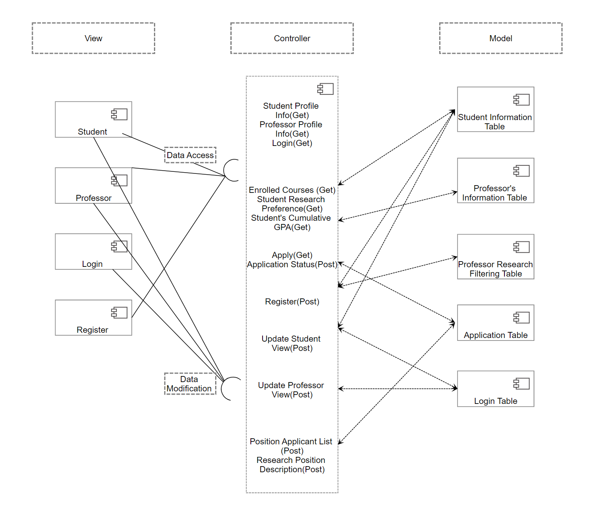
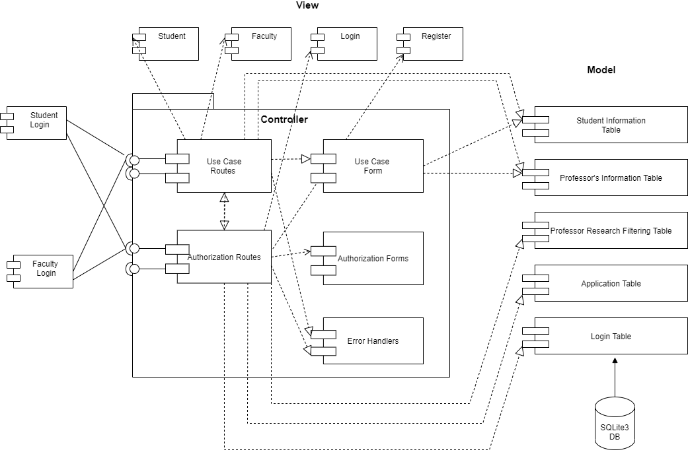

# Academic search engine    

## VRC (Virtual Research Center)
--------
Prepared by: Team 9

---

**Course** : Software Engineering Principles 

---

## Table of Contents
- [Design Document](#design-document)
  - [Project Title](#-your-project-title)
  - [Table of Contents](#table-of-contents)
  - [Document Revision History](#document-revision-history)
- [1. Introduction](#1-introduction)
- [2.	Architectural and Component-level Design](#2architectural-and-component-level-design)
  - [2.1 System Structure](#21-system-structure)
  - [2.2 Subsystem Design](#22-subsystem-design)
    - [2.2.1 Model](#221-model)
    - [2.2.2 Controller](#222-controller)
    - [2.2.3 View and User Interface Design](#223-view-and-user-interface-design)
- [3. Progress Report](#3-progress-report)
- [4. Testing Plan](#4-testing-plan)
- [5. References](#5-references)
- [Appendix: Grading Rubric](#appendix-grading-rubric)

# 1. Introduction

First of all, the role of the platform we will design is to help teachers and students. This also means that the platform website looks different after teachers and students log in with their usernames and passwords. After logging into the platform as a student, first upload the courses they have studied to the website. Secondly, students can also browse the research needs (requirements for certain courses) and research content published by the teacher, and the students should also Upload your contact information to the web page (personal profile page). For teachers, teachers should have the option of publishing research needs, research content, and checking what courses students have taken. After checking the courses the students have taken, the professor can choose students who are suitable for the research project. After the professor selects the students suitable for the research project, when the students log in to the student page, they will find that they may be selected by the professor to participate in a certain research project.

# 2.	Architectural and Component-level Design
## 2.1 System Structure

The UML component diagram with MVC architecture. It reduces the coupling between the user interface and data.  The system causes the controller to request the view data. If it is modifying for fetching data, user’s cannot directly access the database. 
Register: User register an account with personal information. If the register is valid a new account for either faculty or student will be created. The email must be unique in the system. 
Login: These components receive input from the user from their account information. Then check whether or not the login has been successfully created in the system. 
Student: If a student login to their account, the student can edit and update its own information. Students may search for all jobs, apply and be able to view their application status. 
Professor: If a professor login to their account, the professor can edit and update its own information. They may post the research position and delete it.  

**UML component diagram with MVC architecture**

## 2.2 Subsystem Design 

### 2.2.1 Model

Model contains different databases to store information 

Student Information   
When a student registers an account and logs in by User ID and password, the Web application will create a student information database table to store personal information. Attributes, Emails, and WSU ID should be unique.

| Student Profile |   |
| ------- |--|
| First Name        |  
| Last Name         |  
| WSU ID            |  
| Email             |  
| Phone Number      | 
| Cum GPA           |  
| Taken Courses     |  
| Interested research topics     | 
| Programming Experience  | 
| Prior Research Experience         |  
|

Faculty Information

When a Faculty registers an account and logs in by User ID and password, the Web application will create a Faculty information database table to store personal information. Attributes, Emails, and WSU ID should be unique.
|Faculty Profile| |
| ------- |--|
|First Name   | 
|Last Name    | 
|WSU ID       |
|Email        |
|Phone Number|
|

Undergraduate Research Positions

When Faculty has an account and login successfully, Faculty are allowed to select options to post positions information on the web application. Once faculty want to enter the information, this database table will be created and store research position information 
|Research Position Description||
| ------- |--|
|Faculty’s Name|
|Faculty’s Email|
|Faculty’s Phone  Number|
|Research Project Title|
|Project Information|
|Start and End Date|
|Required Time Commitment|
|Research Field|
|Required GPA|
|Required Courses| 
|Maximum Positions|
|

Application

When a student has an account and login successfully,  the student is allowed to submit an application to apply for an interested research position. When the student wants to apply for it, this database table will be created. And,Faculty can change the student’s application status based on interview results. 
|Application| |
| ------- |--|
|Faculty’s Name|
|Faculty’s Email| 
|Student Name|
|Student Email| 
|Statement|
|Application Status| 
|

Login

This database tracks emails and passwords for students and faculty.  It allows users to login. Meanwhile the database also stores new users’ account information after they register.
|Login||
| ------- |--|
|WSU Email|
|Password|
|WSU ID|
|Status|
|

research_position

This database contains all the posted research positions that are posted by faculty members, it will require users to login to check what research positions already have. Since a user wants to view research positions only requires the login, so we need wsu email and password to access this feature first. After access to this feature, we need to have requirements of students gpa and taken courses, we also need to have start date and end date posted by faculty members as well.

|research_position||
| ------- |--|
|WSU Email|
|Password|
|Requiired GPA|
|Required taken course|
|Start Date|
|End Date|

Qualification 

For this part, the reason why we consider this also as a database is because different students might have different Status of Qualifications, so there should be a place to store these data(different status). First as we conclude about research position, qualification also needs a student as a user to sign in first. After the sign in, we got users(student)’s id and name.

|Qualification||
| ------- |--|
|WSU Email|
|Password|
|WSU ID|
|Frist Name|
|Last Name|

### 2.2.2 Controller

Controller:    Controllers are used to read and handle data from databases based on users requests.  

Student Profile Info(GET): it shows student information on the web.

Professor Profile info(GET):it shows Faculty information on the web.

Apply(POST): Students can apply for a position and Apply interacts with positions Applicant list. Once students submit an application,the position applicant list will store students’ information. 

Update student view (Post) :Students can change their profile. It interacts with Student Profile info(Get).Once Students make changes for their profile, modified profiles will be shown on the web.

Update faculty view (Post):Faculty can change their profile. It interacts with Faculty Profile info(Get).Once faculty make changes for their profile, modified profiles will be shown on the web.

Register(POST): Users can register a new account with valid information.

Student research preference(Get) :Students can search research positions based on their research field.

Research Position description(Post):Faculty can post research positions on the web.

|   | Methods                           | URL Path               | Description  |
|:--|:------------------                |:-----------            |:-------------|
|1. |Post research position(Get )       |posted_position         |Faculty users can view posted positions on the web
|2. |View student profile(GET)          |display_student_profile |User can log in as student and then they can check their currently information              
|3. |View faculty profile(GET)          |display_faculty_profile |User can log in as faculty and then they can check their currently information            
|4. |Edit student profile(GET and POST) |edit_profile            |In this feature, users can log in as student and they can edit their current profile after they view their profile and find something not good enough              
|5. |Edit faculty profile(GET and POST) |edit_profile            |in this feature, users can log in as faculty members and they can edit their current profile after they view their profile and find something that needs to be changed for the better             

### 2.2.3 View and User Interface Design 

View is the format of web applications such as font-size and background. The view also displays information or data from the controller on the web.
Register :The user can register an account as long as entered valid information. Emails should be unique and users should select their status. 
Login: The user enters WSU email and password to login and check whether the account is registered and the information is correct. If the user login successfully, student or faculty information will be shown on web pages.
Student: Once  students logged into their account,they can view their information and update change on the web application 
Faculty: Once  faculty logged into their account,they can view their information and update change on the web application 
 

# 3. Progress Report

First of all, we have created four parts: login, logout, register, and research position in the code. As we said in the introduction section, because this app has two index pages, one is for students and the other is for faculty. So in our code, we created two different index pages when the user registered their account. When the user chooses their identity (student or faculty), the system will automatically redirect them to a different index page.  The following is a screenshot after we have completed iteration 1.

This screenshot is for faculty to type some important information about Research position information

**Login**

**Faculty Profile**

**Student Profile**

# 4. Testing Plan

The Unit test looks for errors in methods, objects or subsystems. We will be using the Pytest framework for the API routes testing.
Below is the summary for the research on Pytest

- Pytest is a very mature and full-featured Python testing framework with the following characteristics:
  * Simple and flexible, easy to use
  * Support parameterization
  * Able to support simple unit tests and complex functional tests,
  * Pytest has many third-party plug-ins, and can be customized extensions, such as pytest-selenium (integrated selenium), pytest-html (perfect html test report generation), pytest-rerunfailures (repeated execution of failed cases),pytest-xdist (Multi-CPU distribution) etc.
  * Skip and xfail processing of test cases
  * Can be well integrated with jenkins
  * Report framework----allure also supports pytest
- Operating mode
  * Pytest’s multiple operating modes make testing and debugging more handy.generate a test report after running (html report)
  * Functional Testing:Test whether system meets requirements
    * 1. Function test: check whether the system login function meets the requirements
    2. Interface test: check whether the login interface elements and style meet the requirements, whether the resolution is unclear, the page is disordered or blocked,etc.
    3. Performance test: check the system response time, the concurrent response time of big data.
    4. Localization test: when the system needs to support two status, faculty and student.
    5. Compatibility test: whether it can work normally for different operating systems and browser
    6. Usability test: check the effectiveness, efficiency,ease of use and fault tolerance 3 of the system
    7. Security test: check the limit of number for incorrect password input

# 5. References

S.L. (2020, October 27). Top 8 Python Testing Frameworks in 2021. Test Project.
https://blog.testproject.io/2020/10/27/top-python-testing-frameworks/#pytest

